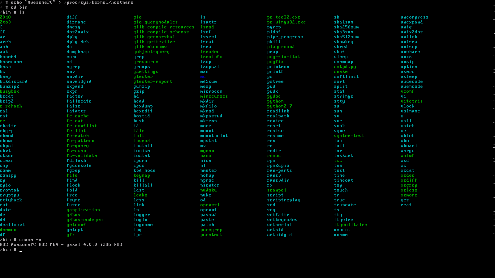
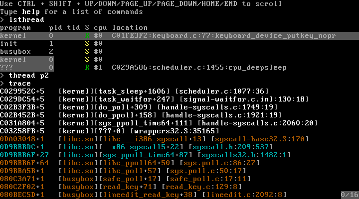
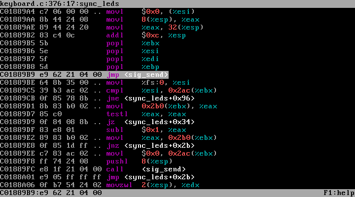
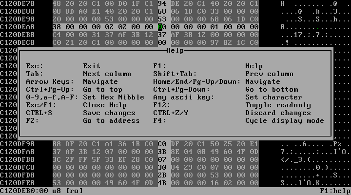
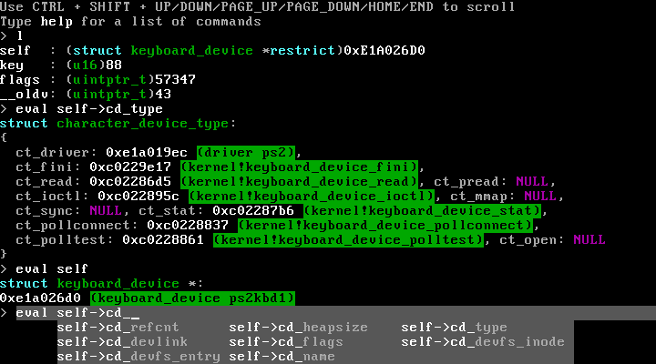

# KOS mk4 OS

A monolithic/modular x86 Operating System + userspace with an emphasis on re-envisioning and extending other mainstream OSes (primarily Linux), whilst still being API/ABI-compatible.

KOSmk4 (the 4th rendition of the KOS operating system series) is a home-made, monolithic, but still modular kernel for __i386__ and __x86_64__ (including its 32-bit compatibility mode) machines, and is written in c++ (though only to use function overloads and exceptions; __all__ ABIs are always C-compatible).

It is designed with a *lot* of tricks up its sleeve to aid during debugging, such as a fully interactive builtin debugger that gives you the ability to interactively analyze the system state when something goes wrong, as well as support for various different forms of debugging using GDB.

In general, KOS isn't designed to re-invent the wheel (no square wheels here), but rather tries to make said metaphorical wheel look and roll as well as possible. What this means is that:
- KOS tries to be fully [POSIX](http://www.open-std.org/jtc1/sc22/open/n4217.pdf) compliant
- KOS tries to be fully API- and ABI-compatible with Linux/GNU/GLibc/... on all supported architectures
- KOS's source components are very tightly interwoven with each other, and both headers and sources make use of the many GCC extensions that exist to both improve generated code, as well as inducing the behavior of different functions
- KOS's sources and headers contain a lot of documentation and I try to give every *magic* number that gets used a proper name. So to understand how KOS works, all that you need to do is to read the documentation of whatever you're looking at
- KOS also includes a DOS/NT emulation mode that allows console programs compiled for NT (using TCC/MinGW/VC/VC++/...) to be executed under KOS. Also note that to do so, KOS will link PE binaries against ELF shared libraries, as PE loading is implemented as an extension to ELF loading (yes: it gets complicated, but it works).

**NOTICE**: KOS uses git submodules (which are required to build KOS), so if you use the *download zip* function, you won't end up with everything that goes into building KOS. So in order to clone KOS in its entirety, you must clone this [git](https://git-scm.com/) through use of:

```sh
git clone --recursive https://github.com/GrieferAtWork/KOSmk4
```


## Table of contents
- [Ported Applications](#applications)
- [KOS Features](#features)
- [Project rules / Code guidelines](#rules)
- [Building KOS](#building)
	- [Getting a Shell](#shell)
	- [Recommended Build Environment](#build-env)
	- [Building 3rd party programs](#building_3rd_party_programs)
	- [`deemon magic.dee`](#magic)
	- [Configuring KOS](#configuring)
- [Programming KOS with an IDE](#programming)
- [Notes on building KOS](#building-notes)
- [Using various emulators to run KOS](#emulators)
- [Automatic System Headers](#headers)
- [GPL Licensing](#gpl)
- [Older KOS Revisions](#old-kos)



<a name="applications"></a>
## Ported Applications

All ported applications can be installed onto your KOS disk image by using `bash $PROJPATH/kos/misc/make_utility.sh i386 <UTILITY_NAME>` (see also: [Getting a Shell](#shell))

- Shell/coreutils
	- [busybox-1.31.0](https://www.busybox.net)
	- [file-5.39](https://github.com/file/file)
	- [midnight-commander-4.8.27](http://midnight-commander.org/) (mc)
	- [tree](https://github.com/rubicks/tree)
- Programming
	- [tcc-0.9.27](https://bellard.org/tcc/)
	- [nano-4.4](https://www.nano-editor.org/)
	- [deemon-200](https://github.com/GrieferAtWork/deemon)
	- [python-2.7.16](https://www.python.org/)
- Games
	- [vitetris-0.58.0](https://www.victornils.net/tetris/)
	- [tty-solitaire-1.1.1](https://github.com/mpereira/tty-solitaire)
	- [2048](https://github.com/mevdschee/2048.c)
	- [nudoku-2.0.0](https://github.com/jubalh/nudoku)
	- [myman-0.7.1](https://sourceforge.net/projects/myman/)
	- [minecurses](https://github.com/EliteTK/minecurses)
	- [nyancat](https://github.com/klange/nyancat)
	- [BSDGames](https://github.com/vattam/BSDGames/)
- Libraries
	- [libncurses-6.1](https://www.gnu.org/software/ncurses/)
	- [libzlib-1.2.11](https://www.zlib.net/)
	- [libstdc++-9.1.0](https://gcc.gnu.org/onlinedocs/libstdc++/)
	- [libffi-3.3](https://github.com/libffi/libffi)
	- [libpng-1.6.35](https://github.com/glennrp/libpng)
	- [libexpat-2.2.9](https://github.com/libexpat/libexpat)
	- [libbzip2-1.0.8](https://sourceware.org/bzip2/index.html)
	- [libuuid-1.0.3](https://sourceforge.net/projects/libuuid/files/)
	- [libjson-c-0.15-20200726](https://github.com/json-c/json-c)
	- [liblzma-5.2.5](https://tukaani.org/xz/)
	- [glib-2.70.3](https://gitlab.gnome.org/GNOME/glib/) (libglib)
	- [libgmp-6.2.1](https://ftp.gnu.org/gnu/gmp/)
	- [libmpfr-4.1.0](https://ftp.gnu.org/gnu/mpfr/mpfr/)
	- [libmpc-1.2.1](https://ftp.gnu.org/gnu/mpc/)
- Misc
	- [X-Server (Experimental)](kos/misc/utilities/README.md#X-server)

<a name="features"></a>
## KOS Features

- Written in c++ (though only using minimal c++ features; the entire ABI is also accessible from c)
	- C++ exception unwind support (both kernel- and user-space)
	- Exceptions such as segfaults can be caught with a regular, old `catch (...)`
- Fully UTF-8 compliant (This kernel supports and uses Unicode!)
	- Practically all system interfaces accept UTF-8, which includes the filesystem
- Debugging
	- Builtin debugging capabilities (as in: actually programmed into the kernel)
		- When the kernel panics, it will try to switch to a builtin debugger
		- Assertions offer options to retry, debug (enter debugger mode) or ignore
		- The debugger offers a commandline-based interface for inspecting the system
		- Will display tracebacks, alongside file/line/function information generated by GCC (s.a. libunwind / libdebuginfo)
			- Also support for unwinding inlined functions, as well as their call-sites
			- 
		- Not to boast, but I've seen ~finished~ hobby OSs with less functionality than this debugger alone
		- Disassemble x86 assembly into human-readable assembly dumps
			- 
		- View and modify memory via a hex editor
			- 
		- Evaluate C-style expressions on local/global variables using a fully featured C expression compiler with over 512Kib of code dedicated to evaluating expressions.
			- 
	- GDB support
		- QEMU features a builtin gdb server, that is supported for debugging the core itself
			- This feature can be used via `./binutils/deemon/deemon magic.dee --emulator=qemu --gdb=emulator`
		- BOCHS can be compiled to support a builtin GDB stub
			- This feature can be used via `./binutils/deemon/deemon magic.dee --emulator=bochs --gdb=emulator`
		- VirtualBox has its own builtin debugger (not GDB), that can be accessed via telnet. KOS's toolchain contains a (self-made) glue-driver that connects to VirtualBox to provide a(n experimental) GDB-compatible interface.
			- This feature can be used via `./binutils/deemon/deemon magic.dee --emulator=vbox --gdb=emulator`
		- Seperately, KOS provides a custom GDB server driver (s.a. `/kos/src/kernel/modgdbserver`) for emulator-independent and real-hardware debugging
			- This driver can also be used to not just debug the kernel core, but also running user-space program. This, alongside the fact that kos and all of its utility programs are built from source, means that using this driver, you can even single-step into system calls and see a *complete* traceback while doing so.
		- Fully integrated with Visual Studio (who knew you could do this... I certainly didn't until I stumbled across some vague reports of GDB debugging support in VS2017, that later turned out to be true)
- multiboot
	- Full (but optional) support for multiboot- and multiboot2-compliant bootloaders
	- Allow the bootloader to provide
		- Memory map information
		- A kernel commandline
			- Support for many easy-to-use commandline options
				- `boot=/dev/hda1`
					- Set the name of the device to-be used as boot partition (and to-be mounted under `/`)
					- Can be used when automatic boot partition detection fails
				- `init=/bin/init`
					- Specify the filename of the initial user-space application to launch
				- ...
					- Many other options exist, but few important enough to be documented here
		- An arbitrary number of additional drivers to-be loaded during boot
			- Especially useful to provide additional drivers that would be required for detecting the boot-device
- i386
	- Kernel-space ring 0
	- User-space ring 3
	- Emulation of instructions not natively supported
		- `rdfsbase`, `rdgsbase`, `wrfsbase`, `wrgsbase`
			- These IA-32e instruction are also provide to 32-bit user-space as an easy and intuitive way of reading/writing the `%fs` / `%gs` base addresses
		- `cmpxchg`, `cmpxchg8b`, `xadd`
		- `cmovcc`, `cpuid`, `nop` (multi-byte)
		- `sfence`, `lfence`, `mfence`
		- `movbe`, `sarx`, `shlx`, `shrx`, `rorx`
		- `popcnt`, `tzcnt`, `lzcnt`, `pext`, `pdep`, `bzhi`, `andn`
		- `xbegin`, `xend`, `xabort`, `xtest` (s.a. RTM below)
		- ...
	- RTM:
		- KOS includes a driver (`modrtm`) that can be used for software-based emulation of **Restricted Transational Memory**.  
		  This is a mechanism by which programs can implement arbitrarily complex lockless atomic operations (only limited by memory and cpu cache restrictions), with the only requirement being that all operations performed must be non-blocking.
		- For this purpose, the `modrtm` driver will temporarily emulate user-space code in a small sandbox, from which it will collect all modifications made to memory by the user-space program, before atomically applying them all at once (in respect to other RTM operations that may attempt to modify the same memory regions)
		- In conjunction to this, KOS also provides system calls to make use of RTM, as well as a public interface in `/kos/include/kos/rtm.h`
	- Accounting of hardware vm86 mode (even though it's never used)
	- Detailed exception analysis
		- Where normally you'd only be able to see a `#UD`, KOS will analyze faulting instructions to
			- Figure out what exactly went wrong and, throw a very detailed exception explaining exactly that
			- Emulate the intended behavior if it turns out that the instruction isn't supported natively (see list above)
- x86_64
	- Same features as also available on i386, as KOS contains support for compatibility mode
	- vm86 support via `libvm86` allows for real-mode-like bios calls to still be made from a controlled 64-bit environment (it's using software-based instruction emulation, dispatched via my home-made x86 emulator `libemu86`)
	- Note that in order to build KOS for x86_64, simply replace all of the mentions of *i386* in command lines with *x86_64* (e.g. `bash $PROJPATH/kos/misc/make_toolchain.sh x86_64-kos`)
- FPU
	- x87 FPU / SSE
	- Automatic capability detection `fxsave` / `fxrstor`
- SMP
	- True multi-core processing, as in BP/APs can be different processors
	- IPI communications
	- Cross-core `invlpg` (TLB-shootdowns)
	- ...
- Multi-threading
	- Each processor may host an arbitrary number of different threads
	- `hlt`-based idling (meaning no CPU cycles when nothing's going on)
	- Simple-to-use synchronization primitives, all of which are derived from `struct sig`
	- User-space support for `futex()`-based synchronization primitives
		- Unlike linux, allows for arbitrarily complex check-expressions (in the context of an interlocked futex operation)
- Scheduler
	- Low-level: Tick-less (i.e. NOT based on `void pit_interrupt() { ++time; yield(); }`), and instead based on a hardware TSC (TimeStampCounter)
		- Hardware is used to calculate a fixed-length interval counter that represents the time since the associated CPU was started (the frequency of this counter is calibrated during boot, and periodically adjusted)
			- Can be implemented via APIC+`rdtsc`, the APIC timer alone, or the PIT
		- Using the TSC, implement a function `tsc_deadline()` that can be used to specify a tsc value after which an interrupt should be fired which can then be used for scheduling
			- For APIC+`rdtsc`, simply write to the `IA32_TSC_DEADLINE` msr
			- For pure APIC or PIT, update the timer reload counters to trigger as close to the given deadline as possible. In this case, the interrupt handler then checks: `if (NOW >= CURRENT_DEADLINE) DO_INTR(); else tsc_deadline(CURRENT_DEADLINE);`, thus continously updating APIC/PIT reload values until the actual deadline has expired
		- The TSC \<\-\> realtime relation is updated/synced through use of periodic RTC/CMOS interrupts
	- High-level: [CFS](https://en.wikipedia.org/wiki/Completely_Fair_Scheduler) based scheduler
		- Whenever a thread becomes ready to run, it gets assigned a quantum length equal to `(NOW - TIME_WHEN_THREAD_STARTED_WAITING) / NUM_RUNNING_THREADS`, meaning that threads that spend most of their time waiting (i.e. interactive threads) automatically get a big performance boost
		- During preemption, the next `tsc_deadline()` is set to `NOW + (NOW - TIME_WHEN_THREAD_STARTED_WAITING) / NUM_RUNNING_THREADS`
	- Power-saving: When a CPU didn't have anything to do for a while, it will shut itself down, such that it can only be re-activated by being sent another Startup-IPI
- Physical memory management
	- Physical memory information and region tracking
		- Processing of memory map
			- Provided by the bootloader (if multiboot- or multiboot2-compliant)
			- Provided by a `ram=[{ "type": "ram", "start": 0x1234, "size": 0x4567 }]` commandline option
				- This one's using json if you're wondering (s.a. `libjson`)
			- Provided by the bios when called from realmode
				- int 15h:%eax = \[0xe820, 0xe801, 0xda88\]
				- int 15h:%eax = \[0x88, 0x8a, 0xc7\]
		- Accounting of
			- NVS memory
			- Device memory
			- Bad (aka. corrupted) memory
	- Bitset-based page-frame allocator
		- Supports atomic (aka. lock-less) allocation of physical memory frames
		- Zone-based, with actual zones being determined, allocated and initialized entirely at runtime
			- Usually, it ends up being 2 zones (low memory before the bios, and high memory where the kernel gets mapped)
- IO
	- User-space support for `iopl()` and `ioperm()` (allowing all `65536` ports to be controlled on a per-thread basis)
		- Note that `ioperm()` isn't implemented as it is in linux, which does a `memcpy()` whenever a thread is preempted. Instead, KOS uses lazy page directory mappings to re-map the `TSS.IOBM` memory region when switching between different threads, and will restore the mapping once one of the io-instructions causes a `#PF`.
		- This means that the overhead of using `ioperm()` is both minimal, and doesn't increase if greater-numbered ioports are used (which, once again: would be the case on linux).
- MMU
	- Support for
		- `invpcid` (selected using `cpuid`)
		- `invlpg` (selected using `cpuid`)
		- `PGE` global pages (selected using `cpuid`)
		- `P32` (normal) and `PAE` paging on i386 (selected using `cpuid`)
		- `PAE.2MiB` and `P32.4MiB` large pages (selected using `cpuid`, automatically made use of if memory mappings allow for it)
		- `PAE.XD` (Execute-disable) (selected using `cpuid`)
		- `P64` (4-level) paging on x86_64
		- `P64.2MiB` and `P64.1GiB` large pages (the later being selected using `cpuid`)
		- `P64.NX` (No-execute) (selected using `cpuid`)
		- Lazy identity-mapping (most of) physical memory on x86_64
	- `mmap()` with support for lazily-initialized and write-back file mappings
		- Lazy file mappings / Copy-on-write
	- Emulated memory access (VIO)
		- Allows for emulation of instruction-level memory access using high-level read/write primitives
			- Using this, KOS can essentially emulate memory-mapped IO within software to expose arbitrary, custom APIs
		- This is quite the expansive system, as it requires emulating __every__ x86 instruction which could possibly access memory (s.a. `libemu86`)
			- The idea is to simply (yeah, emulating ~70% of the x86 ISA is totally simple...) emulate all such instruction and have their memory accesses be performed by dispatching them through a table of virtual memory access primitives (read/write/cmpxch/...)
			- With this done, update the register state like the user of the instruction would expect, before resuming execution
			- The result is the ability to seamlessly inject custom, runtime behavior at arbitrary memory locations
			- Here are a couple of examples which KOS makes possible with this:
				- A memory-mapped identity-copy of the current register state
					- What I find really funny about this is I remember seeing this video on YouTube about that mov-only C compiler, and the dev having to do some questionable hacking to be able to actually have his program loop around. - Well. With this, you can now literally do a `movl $SOME_ADDRESS, OFFSETOF_REGISTER_MAP_EIP` as an alias for `jmp SOME_ADDRESS`
				- A page of memory that always returns a random value when read
					- You're literally able to `mmap("/dev/urandom")`, and the result is a memory mapping where every read, regardless of where is't made, will return a random value each time it is made.
					- And just to re-emphasize: reads from the same location will return different values each time they're performed!
				- An address that, when written to, will terminate the calling thread/process with a status code equal to the written value
				- Fields for reading (and for some: writing) the uid/gid/tid/pid/pgid/sid of the current thread
			- Really though: the possibilities are endless here, and this really isn't something that I've seen before (probably because of the insanity that is emulating every x86 instruction that may access memory), I call dips on naming it VIO!
- Kernel heap system
	- Custom heap implementation (home-made)
	- GC-based memory leak detection
		- Suspend the entire kernel and recursively scan all threads and static memory segments for pointers to heap structures
		- Any such pointer found will mark the associated structure as reachable
		- Any allocated heap structure that didn't get reached can be considered a leak
	- 3-part implementation
		- `heap_alloc()`: Raw heap allocators (need to specify size when freeing memory)
			- Used to implement `kmalloc()`
			- Uses `mman_map_kram()` (The kernel equivalent of `mmap()`) to allocate whole pages
		- `slab_kmalloc()`: Slab allocator support
			- Used to implement `kmalloc()`
			- Slabs are sections of memory suitable for allocating fixed-length structures
			- Slabs are very fast and efficient since they impose minimal overhead for any given allocation (especially for small allocations)
			- Memory allocated from slabs has the downside of not being `realloc()`-able (so `krealloc()` has to emulate it as `malloc()+memcpy()+free()` for slabs)
		- `kmalloc()`: Pretty much the same as the user-space `malloc()`, but takes a set of flags describing its behavior
			- Implemented twice
				- `kmalloc()` throws an exception (`E_BADALLOC`) when the allocation failed
				- `kmalloc_nx()` returns `NULL` when something went wrong (`nx` standing for `NoExcept`)
- File System
	- Support for the well-known FS/VFS-split also seen in linux
		- Any arbitrary directory can be re-used as a mounting point for another filesystem
	- Support for both DOS (Windows) and UNIX-like paths, with the ability to bind arbitrary folders for drives
		- KOS provides flags `O_DOSPATH` and `AT_DOSPATH` to specify that some given path should be interpreted using DOS semantics
		- Additionally, a system call `fsmode(2)` exists that can force-enable/disable `DOSPATH`-mode for an entire process
	- Support for symbolic links
	- Support for device files (both block-(`S_ISBLK()`) and character(`S_ISCHR()`)-devices)
	- Support for devfs (`/dev`)
	- Support for ramfs (`/tmp`)
	- Support for procfs (`/proc/[pid]/...`)
		- `/proc/self`
		- `/proc/[pid]/exe`
		- `/proc/[pid]/fd/[fdno]`
		- ...
- System calls
	- `int 80h`
		- With linux ABI compatibility
	- `lcall $7, $0` (as required by SysV)
		- As a KOS extension, you can also use `lcall $7, $<sysno>` instead of having to use `%eax`
	- `sysenter`
		- This one isn't compatible with linux's ABI (the internals of which aren't publicly documented and could easily be changed and need to be called through VDSO, which is something that KOS doesn't have)
	- `syscall`
		- (x86_64 only) Same ABI as `int 80h`
	- Custom mechanism: Call into ukern segment (s.a. `/kos/include/kos/ukern.h:userkern_syscall()`)
	- System call tracing
		- Every time a system call is invoked, its name and arguments can be logged in a human-readable format
		- s.a. `/kos/src/kernel/modsctrace` and `/kos/src/libsctrace`
	- The most efficient way to perform a system call on KOS is [`call __i386_syscall`](https://github.com/GrieferAtWork/KOSmk4/blob/32d59252432d35c8df8c43768e4f8f12e560ecc7/kos/include/i386-kos/kos/asm/syscall.h#L217) on i386 and [`syscall`](https://github.com/GrieferAtWork/KOSmk4/blob/32d59252432d35c8df8c43768e4f8f12e560ecc7/kos/include/i386-kos/kos/asm/syscall.h#L106) on x86_64
- Modular kernel
	- Allow drivers to be loaded into the kernel at runtime
	- Drivers are ELF binaries
	- Drivers can also be provided by the bootloader (s.a. multiboot)
- Misc. features
	- The kernel has the notion of a `.free` section of memory within the core that contains everything that is only used during initialization (e.g. the kernel's initial bootloader entry point, or device initialization code)
		- Just before transitioning to user-space for the first time, this section is unmapped and made available to the page frame allocator
	- Branch profiling support
		- Using preprocessor magic, every `if`-statement and every use of `likely` / `unlikely` within any kernel source file keeps track of which of its branches got taken what number of times
		- Allows for easy detection of *hot* zones within the kernel, as well as finding `likely` / `unlikely` annotations that are just plainly wrong
	- Built-in bootloader
		- If you flatten the kernel binary, you can directly `dd` it onto some bootable storage device, and have it boot (or in the case of an emulator: mount that flattened binary as a raw, bootable disk image)
		- s.a. `/kos/src/kernel/core/arch/i386/boot/_boot0.S`
		- Hint: This bootloader is used for booting KOS in Bochs and VBox
- Drivers
	- pci
		- Required for detecting IDE ports
	- ide (ata)
		- Support for DMA, LBA48, LBA28 and CHS addressing (preferring DMA)
			- This is real DMA support I might note, as in "Hey, IDE. Copy sector 123 to memory location XYZ and tell me when your done"
	- USB
		- controllers
			- UHCI
		- devices
			- SCSI-based Mass Storage (your typical USB flash-drive)
			- Keyboard
	- fat
		- Support for fat12, fat16 and fat32
		- Support for writing to files
		- Support for creating/renaming/removing files and directories
		- Support for symbolic links (using cygwin's old symlink format)
	- apic/lapic
	- acpi (detected, but tables aren't actually being parsed)
	- iso9660
	- ext2 (read-only)
	- special memory files
		- `/dev/mem`, `/dev/kmem`, `/dev/port`
		- `/dev/null`, `/dev/zero`, `/dev/full`
		- `/dev/random`, `/dev/urandom`
		- `/dev/kmsg`
	- current TTY device (`/dev/tty`)
- Posix
	- Support for
		- 64-bit file offsets (`off_t`, `pos_t`)
		- 64-bit `time_t`
		- Notable functions
			- `signal()`, `raise()`
			- `pipe()`
			- `fork()`, `exec()`
			- `open()`, `openat()`
			- `[p]read()`, `[p]write()`, `lseek()`
			- `[f]realpath[at]()`
			- ... (many, __many__, __MANY__ more! (Just take a look at `/kos/include`))
		- TTY support (with job control; aka. `SIGTTIN` and `SIGTTOU`)
		- File-descriptor based handle management
			- Allows for 2 modes of execution
				- Linear mode (all file descriptors indices have low values)
				- hash-table (file descriptors can have arbitrarily great values)
					- Means you're allowed to `dup2(1, 0x7fff1234)`
- Various custom libraries for different sub-systems
	- <a name="libansitty"></a>libansitty (user/kernel)
		- Implement [ANSI tty escape code](https://en.wikipedia.org/wiki/ANSI_escape_code) processing (`\e[0m`)
		- Written to closely follow what is done by xterm, it is able to host `libcurses` in xterm-mode (s.a. `$PROJPATH/kos/misc/make_utility.sh i386 ncurses`) and run `nano`
	- libbuffer (user/kernel)
		- Implement line/ring/packet buffers used for implementing `pipe()` and terminal canon buffers, as well as sockets
	- libc (user/kernel-limited)
		- Home-made and optimized to minimize the number of necessary startup relocations
			- Have you ever done `readelf -rW /lib/i386-linux-gnu/libc.so.6`?
			- Do you realize that every single one of the lines your terminal just got spammed with will slow down the startup of any program you run on your system?
				- Even with lazy symbol resolving, rtld has to perform 1 write to memory for every relocation it finds during startup
			- Well... Doing the same with my `libc.so`, I'm counting 14 relocations (But mine still has all the same functionality, with almost 100% API-compatibility, and at least 95% ABI-compatibility). And that's not even mentioning all of the extensions found in KOS's libc, but missing from glibc.
		- Enourmous support for practically everything also found in GLIBc (plus some KOS exceptions, plus a larger number of extensions from other platforms such as BSD or Solaris)
		- Of note is the fact that the KOS system headers aren't dependent on KOS's particular libc implementation
			- The system headers will automatically try to detect libc features and substitute anything that isn't supported with inline functions to provide KOS-specific extensions such as `strend()` in a truely portable (as in: not bound to KOS) manner
		- Dedicated assembly for fast implementations for `memcpy()` and friends
		- `<stdio.h>`, `<stdlib.h>`, `<malloc.h>`, `<string.h>`, `<uchar.h>`, ...
		- `<format-printer.h>`, `<unicode.h>`, `<kos/futex.h>`, ...
	- libcmdline (user/kernel)
		- Provide functionality for bash-like decoding of command lines (with support for `\`, `'` and `"` escaping)
	- libdebuginfo (user/kernel)
		- Parse information found in `.debug_info`, `.debug_line`, `.debug_...` to...
			- convert addresses to file/line/name triples (plus some more information)
			- get/set the names and values of locally defined variables at runtime (s.a. [Builtin debugging capabilities](#features))
	- libdemangle (user)
		- Demangle itanium (g++) mangled c++ symbol names into human-readable representations
			- Not really used at the moment since everything in the kernel and user-space uses C linkage with optional C++ wrappers
	- libdisasm (user/kernel)
		- Disassemble x86 assembly into human-readable assembly dumps
		- Used to provide disassembly support within the builtin debugger
	- libdl (user)
		- Full support for ELF binaries / shared libraries
		- Support for ELF thread-local (`__thread`) memory
		- Support for lazy relocations (`R_386_JMP_SLOT`)
		- `dlopen()`, `dlsym()`, `dlclose()`
			- Support for `RTLD_NEXT`
		- Various kos-specific extensions, such as
			- get-module-at-address (`dlgethandle()`)
			- get-name-of-module (`dlmodulename()`)
			- get-file-of-module (`dlmodulefd()`)
			- open-library-with-file-descriptor (`fdlopen()`)
			- lock-module-section-into-memory (`dllocksection()`)
			- ...
		- The dynamic linker library used to implement ELF-based dynamic linking
		- This library is built as position-independent, but written to not contain any relocations
		- This library's binary is copied into the kernel, from where it is then mapped into the user-space of any application needing dynamic linking
			- This is different from Mk3, in that this is the first time that KOS provides the dynamic linking driver as part of user-space, however this change is also what allowed all of the many improvements in functionality and speed
	- libdlmalloc (user)
		- Thin wrapper library around Doug Lea's `dlmalloc()` function
		- Used as basis for libdl's and libc's malloc() functions (though the kernel uses my own heap, and libc may get a custom one too at some point)
	- libinstrlen (user/kernel)
		- Determine the length of any given x86 instruction
		- Mainly used by the kernel to aid during unwinding and exception handling
	- libjson (user/kernel)
		- Implementation of a fully standard-compliant json parser/generator
		- Used to parse runtime configuration options in some places (e.g. the kernel commandline `ram=[{ ... }, ...]` option)
		- Provides a codec-based system for easily converting Json to/from regular, old `struct` objects
	- libkeymap (user/kernel)
		- Translation of key codes (one of `KEY_*` from `<kos/keyboard.h>`) and key modifiers into unicode characters corresponding to the pressed keys
		- Uses a proprietary, custom file format called KMP, that is documented in `<libkeymap/keymap.h>`
		- A compiler is provided for creating KMP files from self-explainatory conf-like files found in `/kos/src/misc/keymaps/*`
	- libm (user)
		- Thin wrapper around math functions actually provided by libc
	- libregdump (user/kernel)
		- Utilities for converting register state structures into human-readable text
	- libregex (user)
		- Port of the deemon regex implementation with additional functionality added
		- Used to implement the POSIX `<regex.h>` header in libc.so
	- libsctrace (user/kernel-driver)
		- Generate human-readable log entries from system call invocation registers. For example:  
		  `sys_open(filename: "/lib64/libc.so", oflags: O_RDONLY|O_CLOEXEC)`
	- libssp (user)
		- Minimal implementation to satisfy GCC's stack-smash-protection function during linking
	- libterm (user/kernel)
		- Provide support for all of the different transformation flags in [`struct termios`](https://en.wikipedia.org/wiki/POSIX_terminal_interface#POSIX:_Consolidation_and_abstraction)
		- This library provides the functionality required for top-level TTY objects in kernel-space, where-as [libansitty](#libansitty) provides high-level support for [ANSI escape codes](https://en.wikipedia.org/wiki/ANSI_escape_code) for stuff like terminal color support, which is then used by hardware display drivers and the builtin debugger.
	- libunwind (user/kernel)
		- Provide for `.eh_frame`-based unwinding of the stack, both in user-space, as well as in kernel-space
		- This library is the back-bone of the entire exception handling system seen all throughout KOSmk4
		- This library supports everything required by the CFI/CFA/FDE-subset of DWARF, including the ability to write turing-complete programs to describe register restore expressions (which are actually used in a couple of places)
			- Note that to simplify encoding of CFA expression, you may make use of `/kos/misc/libgen/cfi/compiler.dee:compileExpression()`
	- libvideo (user/kernel)
		- Provide generic software-based video codec converter functions, as well as the (future) system for interacting with (potentially hardware-accelerated) video processing in the form of simple 2D surface operations
		- Note that currently, none of that actually happens already (that's all left up to future me to (possibly) implement)
	- libvm86 (user/kernel)
		- An entire software-based emulator of the 8086 and its instruction set
		- Yes: I wrote yet another decoder and interpreter for the x86 instruction set (as if `vio.c` and `hw_illegal_instruction.c` weren't enough already)
		- Allows BIOS functions to-be called from protected mode, or even from long-mode
	- libemu86 (user/kernel)
		- The low-level driver for anything that requires the emulation/analysis of x86 instruction. Used by:
			- libviocore
			- libvm86
			- Unsupported instruction emulation
			- Generating detailed errors for hardware exceptions
				- Most notably: I don't like how x86_64 triggers a #GP when accessing unaligned memory. So by inspecting the faulting instruction, I can determine the unaligned address, and throw an `E_SEGFAULT`, allowing the exception to be handled the same way as an access of an unmapped address.
	- libpciaccess (user/kernel)
		- A re-implementation of [libpciaccess-0.16](https://cgit.freedesktop.org/xorg/lib/libpciaccess/) specifically designed to work best on KOS
		- Used to implement PCI access for kernel drivers, as well as all of the same functionality for user-space
		- The user-space version of this library can also make use of [pci.ids.gz](http://pci-ids.ucw.cz/) (which you can install via `make_utility`) to display PCI vendor/device names.
	- ... More libraries may get added in the future without being documented here


<a name="rules"></a>
## Project rules / Code guidelines

- Any libc function exposed by KOS-headers under `/kos/include/*` must check if `__CRT_HAVE_{name}` is defined
- Any function defined by a library other than libc should be located in a folder `<libmylibrary/...>` and must always contain a file `<libmylibrary/api.h>` that defines the common calling convention, as well as the `dlopen(3)` name for the library, as well as a configuration option `LIBMYLIBRARY_WANT_PROTOTYPES`
	- Each function exported by such a library should be exposed as:
	```c
	typedef int (LIBMYLIBRARY_CC *PNAME_OF_EXPORTED_FUNCTION)(int x, int y);
	#ifdef LIBMYLIBRARY_WANT_PROTOTYPES
	LIBMYLIBRARY_DECL int LIBMYLIBRARY_CC name_of_exported_function(int x, int y);
	#endif /* LIBMYLIBRARY_WANT_PROTOTYPES */
	```
- As much as possible from `/kos/include/*` should be generated automatically using `/kos/misc/magicgenerator/generate_headers.dee`
- `/kos/include/hybrid/*` must not have any cross-dependencies to files other than `/kos/include/__std(cxx|inc).h` and `/kos/include/compiler/*`
	- The hybrid API should not be bound to only work under KOS and/or GCC
- The provided `/kos/.clang-format` file is not perfect:
	- See the comments on where it fails within the file itself
- Try not to make direct use of GCC builtin functions. - Use the much more portable functions available through `/kos/include/hybrid/*`. Otherwise, always check if the builtin exists with `__has_builtin()` beforehand (don't worry about GCC not providing `__has_builtin()`; the kos headers are able to emulate that macro for GCC)
	- As an exception to this rule, the following GCC builtins can always be used without first being checked (since they can easily be emulated, or stubbed out on unsupported compilers):
		- `__builtin_va_list`, `__builtin_va(start|end|copy|arg)(...)`
		- `__builtin_prefetch(addr)`
		- `__builtin_choose_expr(cond, tt, ff)`
			- But don't assume that the false-branch doesn't get compiled. - Only assume that it doesn't get evaluated at runtime (this one may be emulated as `cond ? tt : ff` when `__NO_builtin_choose_expr` is defined)
		- `__builtin_offsetof(struct, field)`
		- `__builtin_expect(expr, expected)`
		- `__builtin_unreachable()`
		- `__builtin_assume(expr)`
			- Not actually a GCC builtin, but may be used to instruct the compiler to assume that `expr` is always true (mainly useful as a replacement for `assert()` for when you *really* want to get fast code, and don't care about instabilities; use with caution and remember that it may just be a no-op. Also make sure that `expr` doesn't carry any side-effects, no matter how often it would be evaluated at runtime)
			- Also comes with a macro `__NO_builtin_assume` if it's just a no-op
		- `__builtin_constant_p(expr)` (may be emulated to always evaluate to `false`)
			- Also comes with a macro `__NO_builtin_constant_p` if not supported
		- `__restrict`
			- Even though stdc now defines a standard keyword `restrict`, many compilers don't yet support it to the point where more compilers natively understand `__restrict` than ones that understand `restrict`
			- So with all of this in mind, just write `__restrict` everywhere and let the headers worry about how to provide that keyword
		- `__builtin_types_compatible_p(T1, T2)` (Stubbed out to always return `0`)
			- Also comes with a macro `__NO_builtin_types_compatible_p` if not supported
- Always try to maintain compatibility with any arbitrary post-STDC C/C++ compiler in headers (though native library sources don't have to conform to this)
	- Any header must always ensure that it includes `<__stdinc.h>` at some point, or includes another header that unconditionally includes it (this header is used to do all of the work of creating a common, cross-compiler basis of available features)
	- Anything that only a C compiler could understand must be wrapped inside a `#ifdef __CC__` block (`CC` standing C/C++-Compiler)
		- Always allow an assembler or linker script to include any arbirary header found in `/kos/include/`
		- Related to the later, also consider if an assembly source file could reasonably need to make use of structures defined in your header, and if so: add `[__]OFFSET_MYSTRUCT_MYFIELD` and `[__]SIZEOF_MYSTRUCT` macros describing the absolute offsets of certain fields
			- To assert that these offsets are valid, you may add the header to the list of checked headers in `$PROJPATH/kos/src/_verify/[arch/(i386|...)/]assert_types.c`
	- This rule only exists to allow 3rd party programs to be built using a compiler other than the gcc from the KOS toolchain. One example of where this makes a difference is using `tcc` from inside of KOS after also having installed KOS system headers.
- Libc:
	- Try to maintain header (API) compatibility with GLIBc, MSVC and CYGWIN
	- Try to maintain binary (ABI) compatibility with GLIBc and MSVC (CYGWIN only as far as that is possible)
- KOS-specific, object-related kernel function can be exported as `MYOBJ_IOC_COMMAND` ioctls from files in `/kos/include/kos/ioctl/`


<a name="building"></a>
## Building KOS

Requirements:

- Working installation of [deemon 200](https://github.com/GrieferAtWork/deemon)
	- If not apart of `$PATH`, this will automatically be downloaded + configured + build by:
		`bash $PROJPATH/kos/misc/make_toolchain.sh i386-kos`
		Don't worry: the install location will still be contained within the KOS source tree.
		More specifically, the deemon executable will end up as `$PROJPATH/binutils/deemon/deemon[.exe]`
- binutils/gcc: `$PROJPATH/binutils/i386-kos/bin/i686-kos-*[.exe]`
	- Can be easily downloaded + configured + build by:
		`bash $PROJPATH/kos/misc/make_toolchain.sh i386-kos`
- qemu: qemu-system-i386[.exe] (preferrably in `$PATH`. otherwise, add the location to the `enumerateQEmuInstallationLocations()` function in `$PROJPATH/kos/misc/magicemulator/qemu.dee`)
- On windows: Cygwin
	- You will need to have the following (non-default) packages pre-installed:
		- `make` (obviously...)
		- `wget` (to download 3rd party packages, including binutils and gcc)
		- `mpfr`, `gmp`, `mpclib` (needed for building gcc)
		- `patch` (for patching 3rd party packages to better understand KOS)
		- `gdb` (if you wish to debug KOS)
- On linux: Everything work out of the box, but here's some hints:
	- You'll still need all of the same utilities listed for above under *Cygwin*
	- To install `mpfr` / `gmp` / `mpclib` (as needed for building gcc), I had to do:  
	  ```sh
	  apt-get install libmpc-dev
	  ```
Building KOS (from $PROJPATH):

```sh
./binutils/deemon/deemon magic.dee --build-only --target=i386 --config=OD
```
	
Running KOS (from $PROJPATH):

```sh
./binutils/deemon/deemon magic.dee --run-only --target=i386 --config=OD
```
	
Building+Running KOS (from $PROJPATH):

```sh
./binutils/deemon/deemon magic.dee --target=i386 --config=OD
```

Be careful if you're using an outdated version of `deemon`. I (GrieferAtWork) am the BDFL for it, as well as KOS, and it already happened more than once that I fixed/added something in/to deemon because I needed it for use with the KOS toolchain. So if something's not working, try to re-build deemon for the `$DEEMON_VERSION` declared in `kos/misc/make_toolchain.sh`, and if that also isn't working, try using the most recent version of deemon. One or the other should be working, and if not, create an issue for it and I'll see if I can help.


<a name="shell"></a>
## Getting a Shell

Just like its predecessors, KOS mk4 uses [busybox](https://www.busybox.net/) to provide you with the full user-space bash-like shell experience (Personally, I'm really only interested in the whole kernel-space side of hobby OS programming, alongside the design and implementation of user-space libraries). When it comes to front-ends (and yes: I'm calling a commandline a front-end; deal with it *puts-on-sunglasses*), I loose all interest.

However, I made it as simple as ever for you to get going with an installation of busybox onto your KOS disk image:

```sh
# Make sure that you've already set up the KOS toolchain
bash $PROJPATH/kos/misc/make_toolchain.sh i386-kos

# Make sure that you've built the entirety of KOS at least once (here: in no-optimize-debug mode)
deemon $PROJPATH/magic.dee --target=i386 --config=nOD --build-only

# Do the actual work of downloading, configuring & building busybox
bash $PROJPATH/kos/misc/make_utility.sh i386 busybox
```

That's it. That last command will download, build & install busybox into every i386 KOS disk image that it can find under `$PROJPATH/bin/...`, also meaning that if you choose to clear out `$PROJPATH/bin` (or have just build KOS for a specific configuration for the first time), you will have to ensure that `magic.dee` was run at least once for your intended configuration, followed by re-executing the `make_utility.sh` command

The plan is to add more software to `make_utility.sh` in the future, so that you'll be able to install select third-party software with this easy-to-use method of building them.

If you have any suggestions for software (or even better: code snippets for use in `make_utility.sh` alongside any required patch files), feel free to send them to me and I might add them so that everyone can use them.


<a name="building_3rd_party_programs"></a>
## Building 3rd party programs

Like already mentioned in [Ported Applications](#applications), building 3rd party programs/libraries for use with KOS is done by invoking the `$PROJPATH/kos/misc/make_utility.sh` script.

I'd also like to recommend that you *dont* run `make_utility.sh` as root. While I'm doing my best to get utilities to behave and not try to copy files into host system paths, given that these aren't my projects, I can't guaranty that some of them might still try to do this in certain situations. As such, running `make_utility.sh` as a normal user, 3rd party configure+make scripts won't be able to modify/write files in host system paths.

However, building 3rd party programs sometimes requires additional utilities to be installed. In most cases, these utilities can be read from error messages, however here's a list of some that you'll be needing for quite a few of them:

- `autoconf` + `automake` + `libtool` (for projects that don't come with a ready-made `./configure` script, but instead the raw `configure.ac`)
- `cmake` (for cmake-based projects)
- `gperf` (currently only needed by `fontconfig`)
- `perl` (currently only needed by `openssl`)


<a name="build-env"></a>
## Recommended Build Environment

I neither have the time nor will to make sure that any kind of build environment works.

So with that in mind, I can only recommend you'd use the same one I'm using:

- Windows
- Visual Studio 2017 (Community Edition)
- Cygwin
- QEMU


<a name="magic"></a>
## deemon magic.dee

The `magic.dee` file found in `$PROJROOT` is the primary controller for doing anything with KOS (you can just think of it as my version of `make`)

If the file extension (and the use of [`deemon`](#building) for starting) wasn't enough, it's a deemon script.

To help you understand how this script works to do what it does, here is a documentation about its options

- `-1`
	- Compile in single-core mode (don't run more than one build step at the same time)
- `-v`, `--verbose`
	- Print the full commandlines of processes as they are executed
- `-E`, `-S`
	- Alongside object files, also generate...
		- `-E` preprocessor output files
		- `-S` assembler input files
- `--run-only`
	- Skip the build step and only run KOS
- `--build-only`
	- Skip running KOS and only build the binaries
	- Passed by default when building was started by pressing CTRL+SHIFT+B in Visual Studio
- `-f`
	- Force a full re-build of everything (except for re-formatting the KOS disk image)
	- Passed by default when selecting `Rebuild kernel` in Visual Studio
- `--format-error-messages`
	- Format GCC's and LD's error messages from forms such as `file:line[:column]:...` into what is accepted by Visual Studio's `file(line[,column]) : ...` format (allowing you to click such lines within build output)
	- Passed by default when building was started by pressing CTRL+SHIFT+B in Visual Studio
- `--`
	- Join the remainder of the argument list into a single string seperated by 1-wide space characters and pass that string into the emulator for use as the kernel commandline
		- e.g. `deemon magic.dee -- init=/bin/system-test` will run `system-test` after boot instead of `/bin/init`
- `-n=N` (Defaults to `-n=<number-of-cores-on-your-machine>`)
	- Set the max number of parallel processes to run during building to `N`
- `--emulator=NAME` (Defaults to `--emulator=qemu`)
	- Select which emulator to use, where `NAME` must be one of `qemu`, `bochs` or `vbox`
- `--changed=FILENAME`
	- Force the build system to act as though the file referred to by `FILENAME` has changed
	- The given `FILE` is interpreted relative to the PWD set when `magic.dee` got invoked
- `--gdb=MODE` (Defaults to not-given)
	- Enable GDB debugging support, where `MODE` must be one of
		- `server`: Use the builtin GDB server driver
		- `emulator`: Use the emulators's builtin GDB stub (not supported by all emulators)
	- Note that the GDB server/stub is always created as a server socket `tcp:localhost:1234` on your machine
- `--emulator-started-pattern=TEXT`
	- Print the given `TEXT` to `stdout` when the emulator is started (needed for syncing with Visual Studio)
- `--target=TARGET` (Defaults to automatic detection; see below)
	- Set the target architecture to `TARGET` (which must be one of `i386`, `x86_64`, ...)
- `--config=CONFIG` (Defaults to automatic detection; see below)
	- Set the build configuration (s.a. [Configuring KOS](#configuring))
	- Warning: I usually only build KOS in `OD` and `nOD`, so there is a high chance that the other two configurations won't even build...
- `--gen=FILE`
	- Only execute build steps that lead up to the creation of `FILE` instead of executing everything
	- This option is used to only build `libc.so` and `libm.so` as part of `make_toolchain.sh`
	- The given `FILE` is interpreted relative to the PWD set when `magic.dee` got invoked
- `--gengroup=NAME`
	- Only execute build steps apart of a group `NAME`, as well as steps for dependencies of a group `NAME`
	- Can be used to only build certain sub-components of KOS instead of everything (e.g. `deemon magic.dee --gengroup=libs.libc`)
- `--gengroup-of=FILE`
	- Same as `--gengroup=...`, but instead of specifying the name of some group, only a source file is given
	- This is implemented by taking all build steps with a dependency on `FILE`, then forming a set of all of the groups of those files, before finally running all steps and dependencies of those groups
	- The given `FILE` is interpreted relative to the PWD set when `magic.dee` got invoked
	- This option is intended to be mapped to a key combination within your IDE, where `FILE` should be passed as the file that is currently opened, allowing you to quickly build (only) the part of the system that you currently have opened.
		- On how to do this in Visual Studio, see `$PROJPATH/kos/misc/scripts/vsautoconfig.dee`
- `--regen=PATTERN`
	- Same as `--gen=...`, but select files using a regular expression pattern
	- The given `PATTERN` doesn't get formatted according to the PWD set when `magic.dee` got invoked
- `--driver=NAME[:NAME]`, `--driver=NAME,CMDLINE`
	- Inject a driver `NAME` into the kernel during boot, where `NAME` is either the driver's filename within `$PROJPATH/bin/$TARGET-kos-$CONFIG/os/drivers/`, or a filename within the host filesystem if it contains any slashes
	- Optionally, a commandline `CMDLINE` may be given, which is then passed to the driver during initialization
	- This method of loading drivers makes it possible to give KOS the ability to identify alternative devices or filesystems before having initialized its own filesystem, meaning that KOS can be booted from a device/fs combo not known to the kernel core
	- Note that when using this method to load a driver that has dependencies on other driver(s), you must also inject all dependencies
	- The order in which drivers are given affects their initialization order. However drivers that are dependencies of other drivers are always initialized first (cyclic dependencies are not allowed)
	- Example:
		- `deemon magic.dee --driver=usb-storage:usb`, `deemon magic.dee --driver=usb:usb-storage`
			- OK: `usb` is a dependency of `usb-storage`, and the initialization order is always:
				- `usb`
				- `usb-storage`
		- `deemon magic.dee --driver=usb-storage`
			- Wrong: This will cause a kernel panic telling you that the `usb` driver is missing

##### Target/Config-specific paths

- Before magic starts building, it will ensure that a symlink `$PROJPATH/bin/$TARGET-kos` expands to `$TARGET-kos-$CONFIG`.
	- Note that when GCC is configured, `$PROJPATH/bin/$TARGET-kos/lib` is set up as part of the library path used by things such as `-lc` flags.
	- As such, when using the GCC from the KOS toolchain, it will always link against the versions of KOS system libraries created for the configuration set the last time magic was invoked
- The following paths are selected by `--target=$TARGET` and `--config=$CONFIG`
	- `$PROJPATH/bin/$TARGET-kos/...`
	- `$PROJPATH/bin/$TARGET-kos-$CONFIG/...`
	- `$PROJPATH/kos/include/$TARGET_XARCH-kos/...`
	- `$PROJPATH/kos/src/[...]/$TARGET_XARCH/...`
	- Note that for the last two, `TARGET_XARCH = $TARGET == "x86_64" ? "i386" : $TARGET`

##### Automatic target/configuration detection

- The intended target/configuration is set automatically when not defined explicitly via the `--target=...` and `--config=...` options
- This works by parsing the file `$PROJPATH/kos/.vs/ProjectSettings.json` (which is automatically created and updated by Visual Studio to always reflect the currently selected build configuration)


<a name="configuring"></a>
## Configuring KOS

Many KOS system features can be configured before you start building KOS for real. For this purpose, you can create custom configurations (or use the one of the 4 default configurations). Configurations are created by you writing a new header file `/kos/include/kos/config/configurations/myconfig.h`. For more information on the contents of this file, see the associated [README.md](kos/include/kos/config/configurations/README.md).

Files in this folder are interpreted as configurations, which can then be used with `magic.dee` to build KOS using your custom configuration.

```sh
deemon magic.dee --target=i386 --config=myconfig
```

Additionally, custom configurations also appear in VS/VSC project files (though only once you re-generate them). For this, you can simply re-run `make_toolchain.sh` for any configuration, or directly execute the relevant script (`deemon kos/misc/config/files.dee`).

Build files, binary output, as well as disk images all exist on a per-configuration basis, meaning that after creating a new configuration, you will have to re-install 3rd party library into the new disk images, as well as allow KOS to be re-build from scratch (this is automatically done by `magic.dee`).

As such, when executed, your custom config will produce files under the following paths:

- `/build/i386-kos-myconfig` (temporary build files)
- `/bin/i386-kos-myconfig` (generated binaries, including your disk image)

The following configurations are provided by default:

Name   | Commandline options
=======|====================
`nOD`  | `-fstack-protector-strong`
`nOnD` | `-DNDEBUG`
`OD`   | `-O2 -fstack-protector-strong`
`OnD`  | `-O3 -DNDEBUG`


<a name="programming"></a>
## Programming KOS with an IDE

### VS Code

You will need to install the `C/C++` extension (just search for `C/C++` under extensions)

Afterwards, make sure that `make_toolchain.sh` has already been executed at least once, as it will generate required configuration files for VS code.

### Visual Studio

Make sure that `make_toolchain.sh` has already been executed at least once, as it will generate required configuration files for Visual Studio. Once this has been done, you can use the `Open Folder` function under the file-tab (`CTRL+SHIFT+ALT+O`) to open the `/kos` sub-folder. - DONT OPEN THE ACTUAL ROOT FOLDER (see notes below).

#### Rant on Visual Studio

I personally use Visual Studio 2017 Community Edition for this, as it actually has a fairly unknown feature `Open Folder` which allows for a hacky way to get full support for GDB debugging without having to pay an insane sum of up to $340 for [VisualGDB](https://visualgdb.com/buy/) (I'm doing this as a hobby; I don't have that kind of money; Jeez: I could barely scrape together $10 if that was the asking price)

I mean seriously: Even when you scoure the osdev wiki you'll come across references to [VisualGDB and VisualKernel](https://wiki.osdev.org/Kernel_Debugging), so I really don't understand who wrote that recommendation. - I don't think any of us bare-metal, kernel-development enthusiats (especially newcomers who could use a real, and simple to use integrated debugging experience the most) would be willing to pay that much...

Anyways. - Even though practically no documentation on this feature of Visual Studio (of which you can get the Community Edition for free by the way) exists, I managed to get it working through trial and error.

And if you don't like Visual Studio (or aren't using Windows) I do know for a fact that Visual Studio Code also includes functionality for connecting to a GDB server/stub when you start diving into extensions

### Debugging

So here are your options:

- To debug the kernel, you must start it with one of the following 2 commandlines (both of which will run a GDB stub/server on `tcp:localhost:1234`, and have qemu wait until something connects to it):
	- `deemon magic.dee --run-only --gdb=server --target=i386 --config=OD` 
	This one uses my own personal gdb server that gets loaded into the kernel as a driver. It offers out-of-the-box support for enumerating libraries, drivers, and running threads/processes (offering both `multiprocess+` and `QNonStop:1` functionality)
	- `deemon magic.dee --run-only --gdb=emulator --target=i386 --config=OD` 
	This one uses qemu's built-in gdb stub, which offers less functionality since it won't know how to enumerate threads created by the KOS scheduler, or list all of the libraries/drivers loaded into the kernel, meaning that tracebacks will only include source locations from the kernel core.
	This option is mainly meant for debugging things that happen before the GDB driver is loaded, or things that break the GDB stub driver itself (It's home-made and hacked together based on knowledge leared from observation, qemu's implementation, gdbserver, and bits and pieces of documentation from across the internet)
- To connect to the stub/server, you can do one of the following:
	- Use Visual Studio's Open-Folder function to open the `$PROJPATH/kos` folder and have all of this happen in 1 step when you press the debug button
	- Start a new instance of `gdb` built for a generic `i386` target and type `target remote localhost:1234`
	- Screw around with Visual Studio Code until you get it to connect to that same port, and have it be your debugging experience (I know for a fact that this is possible since I managed to get it to work before figuring out how to get Visual Studio's Open-Folder method to do my bidding)

Notes:

- When opening KOS using Visual Studio, do _not_ just open `$PROJPATH`, but open `$PROJPATH/kos` instead. - Opening the former will not work properly and Visual Studio may even crash after a while since (at least for me) it seems unable to coax with the thousands of source files apart of binutils and gcc. And despite all of the methods that (supposedly) exist to have Visual Studio ignore certain paths within your source tree, all of them only function to hide folders from the Solution Explorer (despite their documentation claiming to also hide them from the source code scanners). So my solution was to move everything that's actually interesting to me into the `$PROJPATH/kos` sub-folder and always open that one when programming.
- Before debugging with Visual Studio for the first time, make sure to have already run `make_toolchain.sh` at least once to ensure that it was able to generate the file `$PROJPATH/kos/.vs/launch.vs.json` (this has to be done dynamically since it must contain some absolute paths depending on where your `$PROJPATH` is located at) (for this purpose, it's likely to work even if `make_toolchain.sh` fails, since the creation of this file is one of the first things it does)


<a name="building-notes"></a>
## Notes on building KOS

The KOS build system is quite complex, as KOS system headers depend on CRT feature definition files which it will automatically generate/update as features are added to, or removed from the kernel or libc.

Some parts of the system headers and libraries are automatically generated. This normally happens as part of invoking `deemon magic.dee`, which will check if changes happened to the sources of such files. (You can easily tell that a file is auto-generated by checking if it starts with `/* HASH CRC-32:... */`)

Note however that you should not attempt to manually modify automatically generated pieces of code. - Doing so will cause the build system to refuse to overwrite your changes so-as to never accidentally delete them without you realizing what happened.

The most notable feature of the KOS build system is the way that it generates libc headers, as well as sources, inline-substitutions, and a few other files.

For this, the KOS system header folder contains crt feature files. These files are literally huge headers with thousands of `#define`s for every publicly exported symbol (they can be found in `/kos/include/i386-kos/crt-features/crt-kos[-kernel].h`).

Using this system, KOS system headers will automatically determine the features provided by the linked libc, and fill in the gaps, thus offering a much more complete API experience, regardless of what the underlying libraries actually offer.

Now assuming that some functionality is missing from linked libraries, this manifests itself by the automatic function substitution system kicking in and providing local definitions (aka. static/inline functions) for pretty much everything found in system headers (e.g. memcpy is immediatly implemented as an inline/static function in `/kos/include/libc/local/string/memcpy.h`)

With these substitutions in place, libraries and the kernel can still be built, however will result in below-optimal code being generated, simple due to the rediculous amount of redundancies.

For more information about the header substitution system, and how it makes it possible to use KOS's headers for toolchains other than KOS itself (requiring only minor, to no modifications at all), take a look at the section on [Automatic System Headers](#headers)


<a name="emulators"></a>
## Using various emulators to run KOS

KOS supports emulated execution via one of the following emulators

- QEMU (default)
	- Start this emulator with:
		- `deemon magic.dee`
		- `deemon magic.dee --emulator=qemu`
	- This is the only emulator that supports the use of a kernel commandline, as well as boot modules
	- Install locations searched for the qemu executable are enumerated by `enumerateQEmuInstallationLocations()` in `$PROJPATH/kos/misc/magicemulator/qemu.dee` (by default this list contains `$PATH`)
- Bochs
	- Start this emulator with:
		- `deemon magic.dee --emulator=bochs`
	- Install locations searched for the bochs executable are enumerated by `enumerateBochsInstallationLocations()` in `$PROJPATH/kos/misc/magicemulator/bochs.dee` (by default this list contains `$PATH`)
- VirtualBox
	- Start this emulator with:
		- `deemon magic.dee --emulator=vbox`
	- Install locations searched for the qemu executable are enumerated by `enumerateVirtualBoxInstallLocations()` in `$PROJPATH/kos/misc/magicemulator/vbox.dee` (by default this list contains `$PATH`)


<a name="headers"></a>
## Automatic System Headers

KOS uses various interpreter/intermediate compilers for centralizing the definition, substitution, aliasing, binding, and documentation of most system headers containing definitions of functions exported from libc. (A similar system also exists for defining and updating system calls)

This system is tightly interwoven with the CRT feature files described in the section [Notes on building KOS](#building-notes), and will automatically provide and substitute definitions for not only C-standard headers, but also a variety of others.

This is done via a custom function definition protocol implemented by a deemon program found in `$PROJPATH/kos/misc/magicgenerator/generate_headers.dee`, which when run, will parse and link the definition files from `$PROJPATH/kos/src/libc/magic/*.c` to gain knowledge of what goes where, how everything looks like, what annotations may be applied to functions, how functions are implemented, and so on...

As the end result, KOS is able to provide definitions for many header functions while simultaniously exporting them from both libc (and sometimes the kernel) in such a way that the possibility of mistakes happening due to redundancy falls away (e.g. all function prototypes of memcpy() are annotated with `ATTR_NONNULL((1, 2))`, and despite this specific annotation existing in possibly more than 20 places, any changes to it would only require a single modification of the tags in `/kos/src/libc/magic/string.c`)

Additionally, when using KOS headers with a CRT other than KOS, this makes it possible to substitute KOS-specific extensions such as `strend()` by automatically providing a local implementation of the function though `/kos/include/local/string/strend.h`, where this variant of the function is implemented identically to the variant exported by KOS's libc, meaning that in the event of changes having to be made to its implementation, all that's required is another single alteration in `/kos/src/libc/magic/string.c`

In the end, thanks to the feature definition files (which basically just needs to contain a list of all the symbols exported from the CRT against which the hosted binary is to-be linked), 90% of the usual work of having KOS headers be hosted by some new libc will only require the addition of a new crt-features file, as well as making use of it in `/kos/include/__crt.h`, making the KOS toolchain extremely configurable, as well as versatile and portable. (That is: once you understand how everything fits together)

Another useful feature of this lies in the fact that it allows any source file to force the use of local definitions of certain functions, preventing that source file from becoming dependent on being linked against libc (being able to do this is required to build a dynamic linker, which couldn't very well do its job of linking if it had to link itself first...).
For example, an application could force the headers to provide a local implementation of `sprintf()`:

```c
/* Load CRT features so we can modify them to our liking */
#include <__crt.h>

/* Delete sprintf() support from libc (`sprintf()' will now be
 * defined with a local implementation that invokes `vsprintf()') */
#undef __CRT_HAVE_sprintf

/* Delete vsprintf() support from libc (`vsprintf()' will now be
 * defined with a local implementation that invokes `format_vprintf()') */
#undef __CRT_HAVE_vsprintf

/* Delete format_vprintf() support from libc (`format_vprintf()' will
 * now be implemented entirely within this compilation unit, and no
 * longer be loaded from libc) */
#undef __CRT_HAVE_format_vprintf

/* The same procedure could now be repeated for all of the functions
 * which may be called by `format_vprintf()', until eventually there
 * won't be any trace left of the dependencies normally related to
 * `sprintf()' */

#include <stdio.h>

/* This application does not have a dependency on libc:`sprintf' */
int main() {
	char buf[64];
	sprintf(buf, "foo = %d", 42);
	printf("%s\n", buf);
	return 0;
}
```

Note however, that some functions can't easily be substituted (e.g. `open(2)`). As such, if a function appears in a header, but isn't provided by libc, nor has a local implementation, the function will simply not be defined. (giving you a compile-time error, rather than having to wait for link-time)

Lastly, if there ever ends up being some gaping flaw in how KOS defines functions in headers, the fix will always be as simple as making a limited number of changes to the code generator scripts, instead of requiring millions of code locations to be updated, only to forget a hand full of them and have them lingering as dormant bugs to re-surface years in the future.


<a name="gpl"></a>
## GPL Licensing

WARNING: NOTHING IN THE FOLLOWING SECTION IS LEGAL ADVICE, OR MAY BE CONSIDERED AS LEGALLY BINDING IN ANY SORT OF COURT! IT'S ONLY PURPOSE IS TO HELP CLARIFY HOW TO DEAL WITH CODE THAT IS LICENSED DIFFERENTLY!

Certain components of KOS, its (system-)headers, libraries, or some other component found as part of its source tree, as one is presented with in whatever form of distribution you may encouter it (KOS's source tree) in, may contain few parts that are not necessarily licensed under the ZLib license (the ZLib license being the primary license under which all of the *new* (as in: specifically written for the purpose of use with KOS) code falls)

~~One example for this would be the implementation of the libc function `qsort()`, as exported from the header `<stdlib.h>`, who's implementation has been lifted from GLibc (which is not licensed under ZLib, and as such requires derived code's direct (as in: static inclusion during linking, or automatic inline substitution during compilation, as opposed to dynamic linking at runtime) use in any derived software to also comply with its (GLibc's) license agreement)~~

For this purpose, note that the ZLib license is compatible with GPL ~~(which is the license that applies to the aformentioned `qsort()` function)~~, meaning that use of KOS in its entirety in any product requires that product to comply with the requirements of both GPL, as well as ZLib.

For the purpose of using only parts of KOS (such as copy-pasting a piece of KOS-specific (*new*) code), it is usually sufficient to include a copy of the copyright notice that should be located at the top of the original source file, or can also be found in `$PROJPATH/LICENSE`, as well as include a reference (e.g. a link) to the original source (and git revision/commit id), and document the fact if changes have been made. However, once any code is included that is not part of the aformentioned KOS-specific (*new*) code (such code is plainly marked as such), you once again will have to comply to its specific copyright requirements as well.

Note that for this purpose, GPL was only mentioned as an example, but not as the rule, as other pieces of code may exist that use different licenses yet.

In practice this means that the KOS source tree, and its repository are required to remain open-source forever, thus complying with GPL, however other projects are allowed to lift KOS-specific code (and KOS-specific code only), and only have to comply with requirements stated by the ZLib license. (e.g. You could steal my pageframe allocator system and use it in a commercial kernel, so-long as you neither claim to have written it yourself, and as an extension: don't claim to have written everything in your project yourself, as well as take the blame when it does end up breaking for some reason at some point)

Another important distinction applies to GPL code that has been modified for the purpose of being made functional with KOS. Such code will always be marked as such and must be handled as falling under both the GPL, and the ZLib license (the original *base* code being GPL, and the changed made (i.e. an imaginary *\*.patch* file) being ZLib), meaning that it (the end-product of the imaginary *\*.patch* file), too, has to remain open-source, may not end up being used in commercial products, and any further changes made to it in the context of other projects will also have to be marked as such (in this case it sufficies to include all pre-exting copyright notices, before adding your own (GPL- and ZLib-compatible) license alongside a comment stating something something along the lines of `Originally lifted from https://github.com/GrieferAtWork/KOSmk4/..., before changes were made to the original source material`) The exact changes are not required to be marked on a per-line basis, since the inclusion of a reference to the original source (alongside a git revision/commit id) would allow one to perform a diff between the two versions to determine changes made.


<a name="old-kos"></a>
## Older KOS Revisions

- [KOSmk1](https://github.com/GrieferAtWork/KOSmk1) (30.11.2016 - 01.04.2017)
- [KOSmk2](https://github.com/GrieferAtWork/KOSmk2) (05.07.2017 - 24.11.2017)
- [KOSmk3](https://github.com/GrieferAtWork/KOSmk3) (10.02.2018 - 02.06.2018)
- [KOSmk4](https://github.com/GrieferAtWork/KOSmk4) (01.09.2018 - ...) (You are here)

